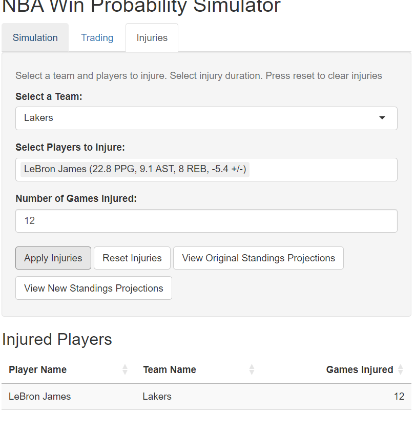

```{r setup, include=FALSE}
knitr::opts_chunk$set(echo = TRUE)
```

## GitHub <https://github.com/425-625-Fall-2024/425-625-Fall-2024/tree/main/project>

## Abstract

This report examines how changes in NBA team rosters, through trades and injuries, impact the projections for expected wins and losses. The project builds on team-level simulation models developed by Dr. Brian Macdonald, making them more granular to project the effects of players changing teams or missing games. The output is a website that allows users to simulate trades and injuries. The analysis utilizes publicly available player-level box score data through HoopR. The central focus is on Box Plus/Minus (BPM), which quantifies a player’s impact by measuring how many points their team scores versus concedes while they are on the court. To predict game results, the Skellam distribution is applied using each team’s recalculated average BPM, which dynamically changes when rosters change. The model can simulate various scenarios, from trades with minor impact to blockbuster trades or major injuries that significantly change a team’s projected wins. Results show that BPM is a useful tool for generating quick approximations of a player’s impact but has notable limitations. For instance, it might underestimate intangible factors like team chemistry, or misrepresent a player’s impact. A notable example is LeBron James, whose average BPM of -5.4 in the current data suggests the Lakers perform better without him and that trading him away might be beneficial to the team, something almost all basketball fans would dispute. Despite the shortcomings of BPM, the website is effective in simulating how roster changes impact league standings.


## Introduction
In the NBA, trades, injuries, and other roster moves can shift the trajectories of an entire season. Understanding the impact of these changes on team performance, seed, and overall season outcomes is something that can be projected. Previous models developed by Dr. Brian Macdonald have shown that simulations that use the Skellam distribution are useful in projecting team-level outcomes. However, this model lacked granularity, making it hard to understand the impact of player-level changes on team outcomes.
This project addresses this issue by using player-level box score data from HoopR and focusing on Box Plus/Minus as the central statistic. BPM offers a way to quantify player impact, though it does not capture intangible qualities. Combined with the Skellam distribution, which assumes that team scores follow Poisson distributions, the model translates BPM-based expected scores into predicted win probabilities for each game. The following sections will explain the website’s features, including the Simulation, Trading, and Injuries Pages, along with the modeling assumptions, case studies showing minor trades, blockbuster moves, and injury scenarios, and conclude with a discussion of takeaways, the model’s limitations and potential areas for future improvement.


## Website

### Simulation Page

The Simulation Page allows users to select an NBA team and view their projected record and win probabilities for upcoming games based on team-level BPM values. For example, selecting the 76ers displays their predicted win-loss record for the season along with win probabilities for their upcoming games.


### Trading Page
The Trading Page simulates the impact of player trades on team performance and projected standings. For instance, trading Kyle Lowry for Eric Gordon and Nikola Vučević showed that the Bulls were projected to lose one more game post-trade, while the 76ers gained an additional win. Users can analyze the pre-trade and post-trade results through looking at how trades impact each team’s BPM, and viewing the pre-trade and post-trade standings. As seen below, the standings showed that the trade would drop the Bulls from a projected 8th seed to a 9th seed in the East, pushing the Pacers into the 8th spot.

 


### Injuries Page

The Injuries Page allows users to simulate how injuries to key players impact a team’s performance. For example, removing LeBron James from the Lakers’ roster for 12 games resulted in an increase in the team’s average BPM and a projection for the Lakers to win one more game. This is counterintuitive and highlights a potential limitation of the model. In LeBron’s case, BPM doesn’t capture his intangibles like leadership or basketball IQ and penalizes his team for his negative BPM.

## 


To better understand the statistics behind these pages, we will examine the modeling and analysis that are behind the website’s outputs.

## Modeling/Analysis

### Skellam Distribution

The primary goal of the model is to predict the outcome of every upcoming NBA game using team-level BPM values, which are aggregated from player-level data. If $\lambda_1$ is the expected score for Team A and $\lambda_2$ for Team B, expected scores are then calculated as:

$$
\lambda_{\text{team}} = \text{league_avg_points} + \text{avg_bpm}
$$


Here, $\text{league_avg_points}$ is the league-average team points per game, and $\text{avg_bpm}$ is the selected team’s average BPM value. If a team has a positive BPM, it suggests that they are expected to score above the league average, while a negative BPM suggests they are expected to score below the average.

Once the two lambda values are calculated, they are used as parameters in the Skellam distribution. The Skellam distribution models the difference between two Poisson random variables. A fundamental assumption is independence of the two Poisson variables, which might not actually be the case with NBA scores. However, we assume that team scores in NBA games follow a Poisson distribution and are independent.

If $X \sim \text{Poisson}(\lambda_1)$ is Team A’s score and $Y \sim \text{Poisson}(\lambda_2)$ is Team B’s score, then the difference in scores $D = X - Y$ follows a Skellam distribution with the two lambdas as parameters:

$$
D \sim \text{Skellam}(\lambda_1, \lambda_2)
$$

The probability that Team A wins is given by the probability that D is greater than 0. These win probabilities are then aggregated across all remaining games in the season to calculate each team’s predicted final seed and expected total wins. This process dynamically updates for any changes in the team rosters caused by user-inputted trades or injuries.
Again, this model assumes that NBA scores follow a Poisson distribution, which might not reflect the real-world. Also, as mentioned before, there are several limitations to using BPM. It does not account for coaching, home-court advantage, team chemistry, or anything that doesn’t show up in a box score. Still, despite these limitations, BPM is a good metric for our purposes. BPM is a very popular statistic, and users can interact with the website, seeing the impact trades and injuries have on projected wins and average BPM, without having to understand the calculations behind the website. 

## Case Studies
#### 1. A Minor Trade with Minimal Impact - Butler to Warriors

We consider a trade involving Miami's Jimmy Butler for Golden State's Andrew Wiggins and Buddy Hield. There have been rumors of Butler potentially being traded to the Warriors. The respective BPM values for the players are the following:

-   Jimmy Butler: 3.4 BPM

-   Buddy Hield: 3.2 BPM

-   Andrew Wiggins: 2.2 BPM

The Model Outputs are the following:

-   Pre-trade average BPM:

    -   Heat: 1.07

    -   Warriors: 1.40

-   Post-trade average BPM:

    -   Heat: 1.12
    -   Warriors: 1.36

-   Projected Changes in Wins

    -   Heat: 0

    <!-- -->

    -   Warriors: 0

Despite the trade impacting the average BPM, the changes were minimal and did not result in changes in any of the projected standings or records. Trading for a star like Butler would likely have an impact on a team’s performance, and this shows how trades that impact factors like team chemistry but have a minimal impact on BPM, won’t lead to large changes in the model’s projections. The screenshot from the website below shows this lack of change.


#### 2. A Blockbuster Trade - KD To Memphis

Next we examine a hypothetical trade involving the Suns’ Kevin Durant and Jusuf Nurkic for Memphis’ Jaren Jackson, Marcus Smart, and Desmond Bane.

-   Kevin Durant: 2.5 BPM

-   Jusuf Nurkic: -1.2 BPM

<!-- -->

-   Jaren Jackson Jr.: 6.4 BPM

-   Marcus Smart: 4.0 BPM

-   Desmond Bane: 4.4 BPM

The Model Outputs are the following:

-   Pre-trade average BPM:

    -   Grizzlies: 3.5

    <!-- -->

    -   Suns: 0.01

-   Post-trade average BPM:

    -   Grizzlies: 2.87

    <!-- -->

    -   Suns: 0.76

-   Projected Changes in Wins

    -   Grizzlies: -1

    <!-- -->

    -   Suns: +1
    
As seen below, this trade improves the Suns’ projected performance, moving them from the 10th seed to the 8th seed in the standings. The Grizzlies experienced a slight decline in both BPM and projected wins. Still, it is a bit surprising that such a blockbuster trade would only result in a change of 1 projected win for both teams.


#### 3. Injury Scenario - Jokic Season-Ending Injury

Next, we will explore the impact of a season-ending injury on Jokic, the leading candidate for MVP. His BPM is 9.3 and removing him for the remaining 58 games of the season can illustrate the impact of losing someone who is arguably the best player in the world. 

The Model Outputs are the following:

-   Pre-injury average BPM:

    -   Nuggets: 1.19

-   Post-injury average BPM:

    -   Nuggets: 0.68

-   Projected Changes in Wins

    -   Nuggets: -1

The model suggests that Jokic being injured for the rest of the season would cause Denver to only lose one more game than otherwise. Again, this is another key limitation of BPM: it doesn’t always capture the true influence of great players like Jokic. Below, we can see that the Nuggets’ projected seed drops from 6th to 7th in the standings.


## Conclusions and Future Work

This project achieved its goal of creating a website that allowed users to evaluate the impact of trades and injuries on NBA team performance using BPM data and the Skellam distribution. It provides a simple approach to analyzing how roster changes influence standings and win projections by dynamically recalculating expected scores and win probabilities.
However, the model’s greatest limitation is the assumption that a team’s performance is the sum of its components. The model takes aggregated BPM values of individual players, which are an oversimplification that can lead to inaccuracies, as seen in the minor projected impact of trading Kevin Durant for multiple players and the unexpectedly small drop in wins from Nikola Jokic’s season-ending injury. Basketball performance is influenced by more than individual contributions; factors like team chemistry, coaching, and other intangibles cannot be captured through BPM-based models. Future work could focus on developing a more sophisticated model that better accounts for team dynamics and other advanced analytics.

